# 基于Springboot的学科竞赛管理

## Springboot-0035


## 技术栈

Springboot mybatisplus vue mysql maven


## 数据库表(9张)


## 功能介绍

```properties
管理员：管理员登陆后可对系统进行全面管理，管理员主要功能模块包括个人中心、学生管理、教师管理、赛项信息管理、赛项报名管理、奖项统计管理、管理员管理以及系统管理，管理员实现了对系统信息的查看、添加、修改和删除的功能。

学生：学生进入本学科竞赛管理系统的设计与实现前台可查看系统信息，包括首页、赛项信息以及新闻资讯等，注册登录后主要功能模块包括个人中心和赛项报名管理。
```


## 图片

### 前台


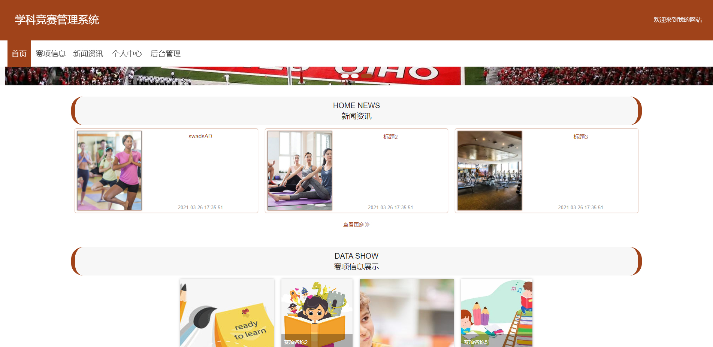


### 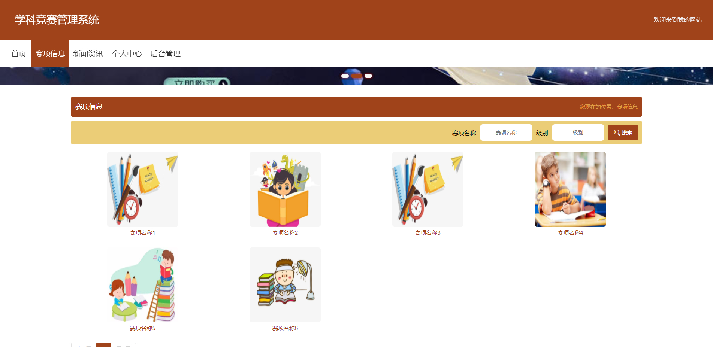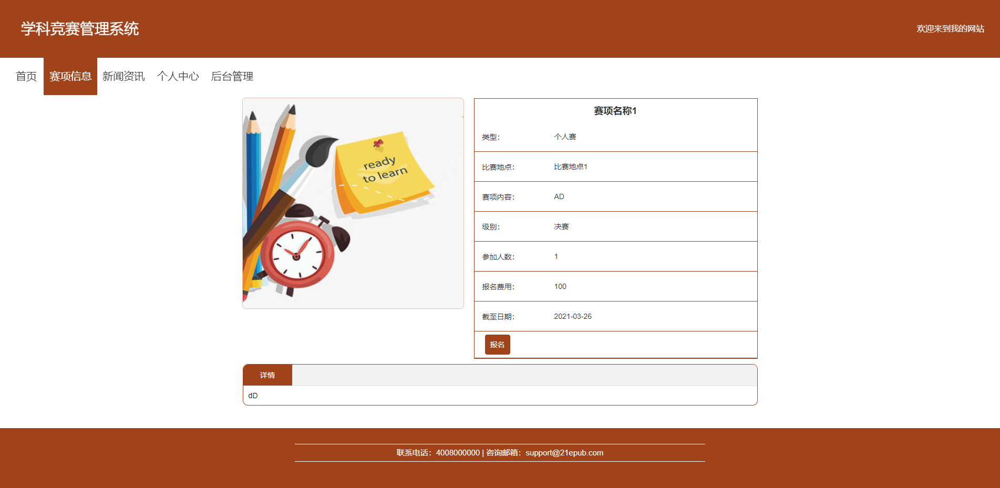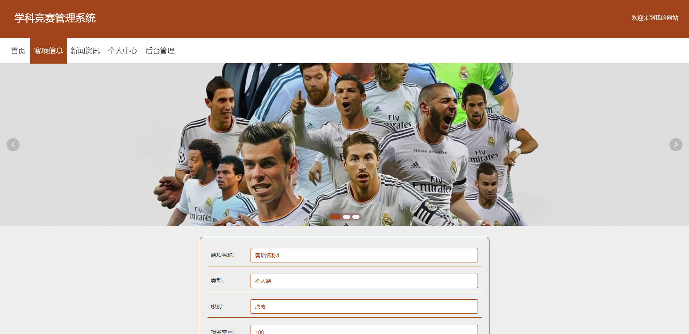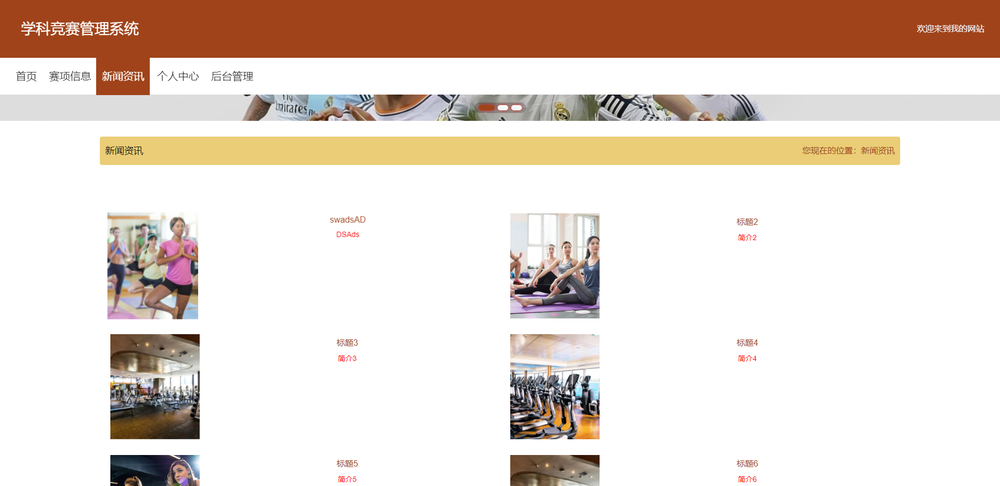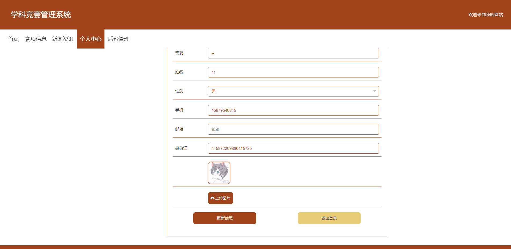后台


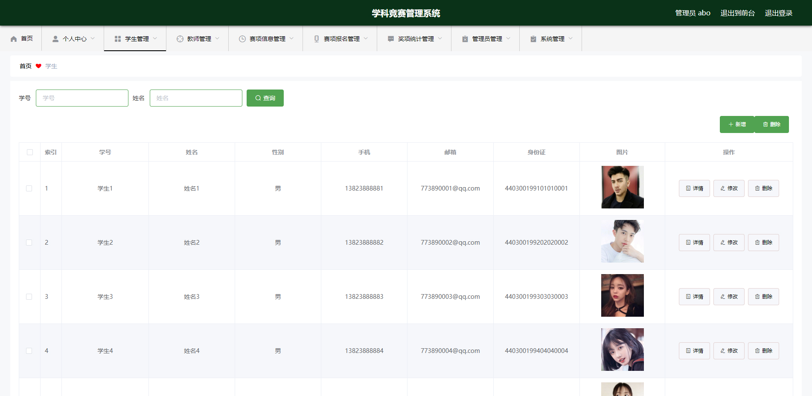

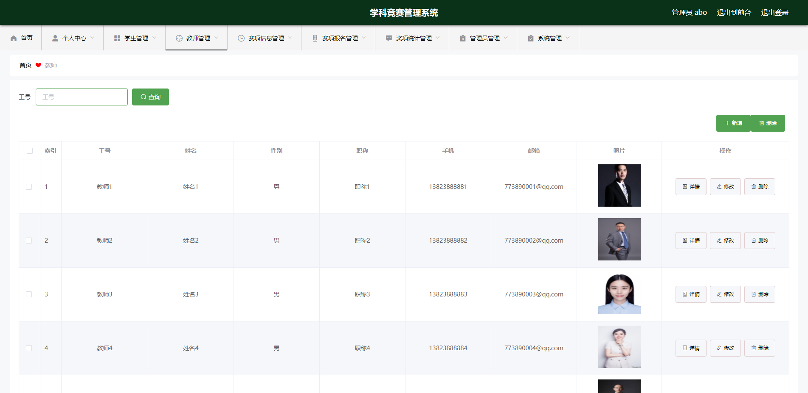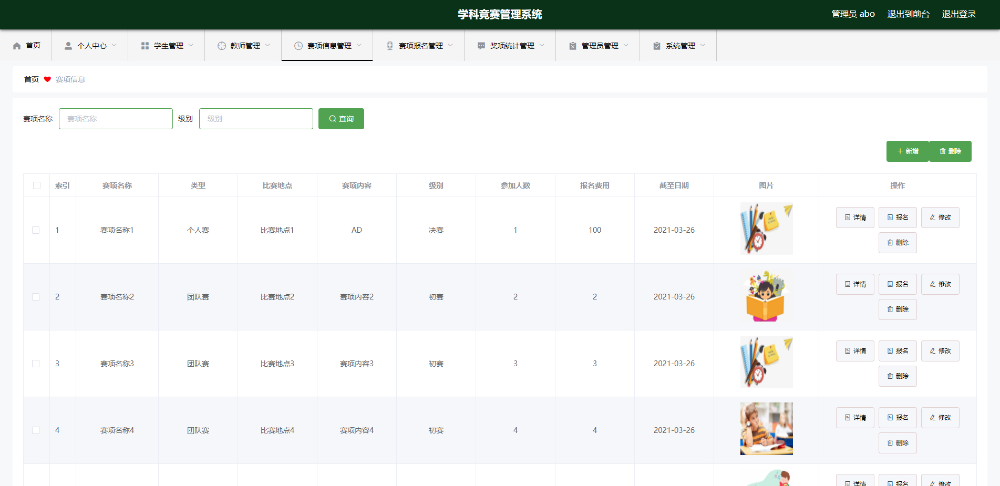

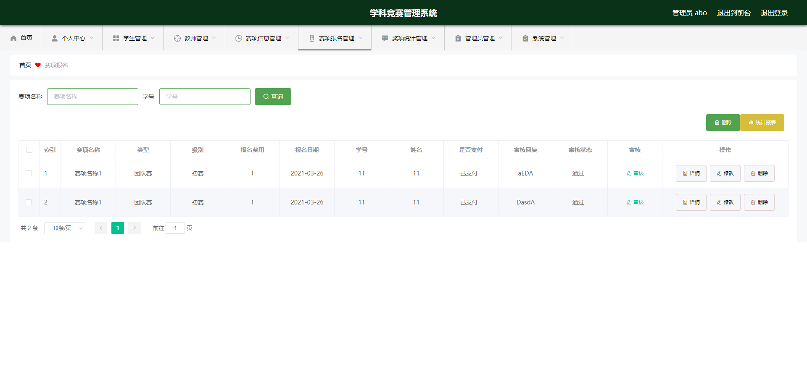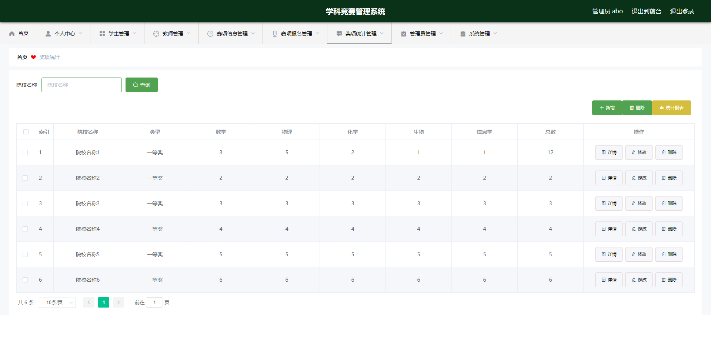


## 访问路径

### 前台

```properties
http://localhost:8080/springbootpx13e/front/pages/login/login.html

账号 11
密码 11
```

### 后台

```properties
http://localhost:8080/springbootpx13e/admin/dist/index.html#/login

账号 abo
密码 abo
```


## 功能图

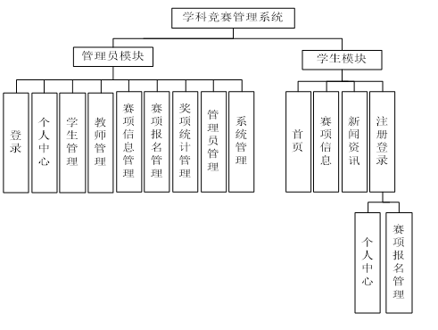


## 文档目录

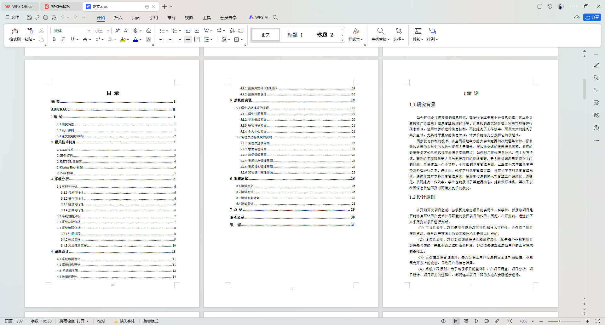


## 打赏或交流


